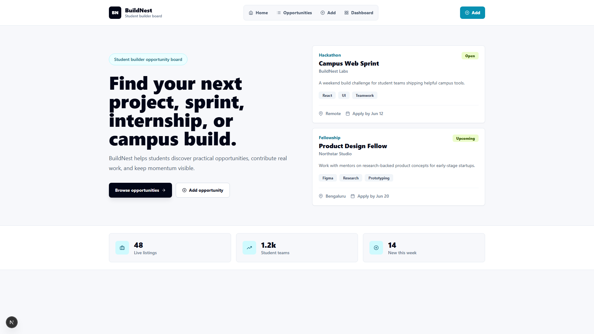
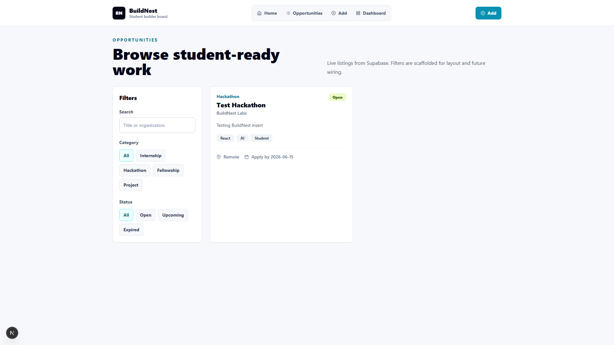
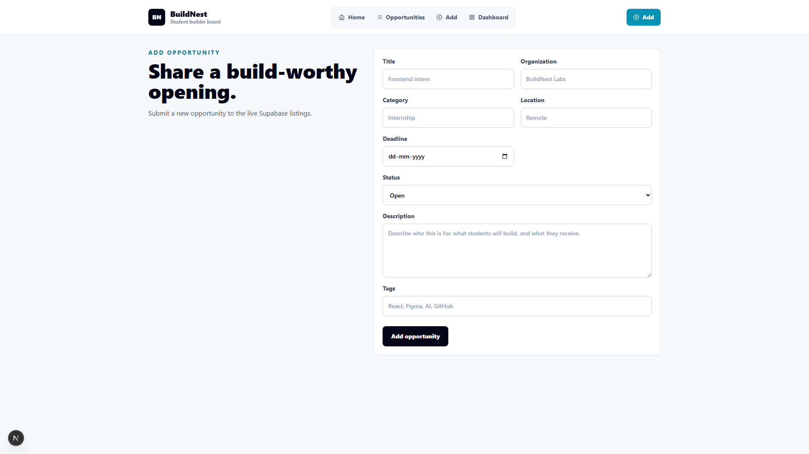
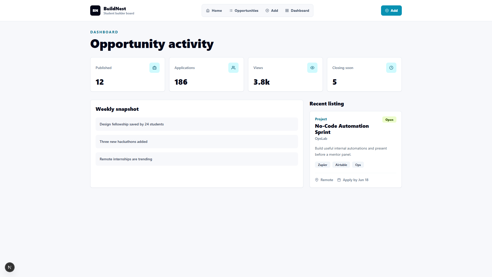

# BuildNest v2

## Overview

BuildNest v2 is a modern student builder opportunity board for discovering, adding, and browsing internships, hackathons, fellowships, and project openings.

The app uses a Next.js App Router frontend with Supabase as the live data source for opportunity listings. Day 1 scope focuses on a clean browsing experience, a create-only opportunity form, and lightweight client-side filtering.

## Features

- Home page with featured opportunity cards and launch metrics
- Live opportunities page powered by Supabase
- Add Opportunity form that inserts new rows into Supabase
- Client-side search by title or organization
- Category filters: All, Internship, Hackathon, Fellowship, Project
- Status filters: All, Open, Upcoming, Expired
- Loading, empty, and error states for opportunity browsing
- Responsive Tailwind UI for desktop and mobile screens
- Dashboard scaffold for opportunity activity and recent listing highlights

## Tech Stack

- Next.js 16 App Router
- React 19
- TypeScript
- Tailwind CSS
- Supabase JavaScript client
- React Icons

## Architecture

```text
app/
  page.tsx                 Home page
  opportunities/page.tsx   Server-rendered Supabase read route
  opportunities/loading.tsx
  add/page.tsx             Add Opportunity route
  dashboard/page.tsx       Dashboard scaffold

components/
  Navbar.tsx
  OpportunityCard.tsx
  OpportunityForm.tsx      Client-side Supabase insert form
  OpportunitiesList.tsx    Client-side search/filter wrapper
  Filters.tsx

lib/
  supabase.ts              Supabase browser/server client

types/
  opportunity.ts           Opportunity table types
```

The opportunities page fetches live rows from the `opportunities` table on the server, then passes them into a client component for search and filter behavior. The add form inserts only the current database columns and redirects to `/opportunities` after a successful create.

## Setup

```bash
npm install
npm run dev
```

Open:

```text
http://localhost:3000
```

Build check:

```bash
npm run build
```

## Environment Variables

Create `.env.local`:

```bash
NEXT_PUBLIC_SUPABASE_URL=your_supabase_project_url
NEXT_PUBLIC_SUPABASE_ANON_KEY=your_supabase_anon_key
```

Only use the public Supabase anon key in this project. Do not commit real `.env.local` values.

Supabase table expected by the app:

```sql
create table opportunities (
  title text not null,
  organization text not null,
  category text not null,
  status text not null,
  description text not null,
  location text not null,
  tags text[] not null,
  deadline date not null
);
```

For the current no-auth MVP, reads and inserts require Supabase RLS policies similar to:

```sql
alter table opportunities enable row level security;

create policy "Anyone can read opportunities"
on opportunities for select
using (true);

create policy "Anyone can insert opportunities"
on opportunities for insert
with check (true);
```

## Deployment

Recommended deployment target: Vercel.

1. Connect the GitHub repo to Vercel.
2. Add the environment variables in Vercel Project Settings.
3. Deploy from the `main` branch.
4. Confirm `/`, `/opportunities`, `/add`, and `/dashboard` load successfully.

Repository:

```text
https://github.com/ItzPranav61/buildnest-v2
```

Launch tag:

```text
day1-launch
```

## Future Roadmap

- Add authentication and role-based moderation
- Add edit and delete flows
- Add application tracking for students
- Add admin review queue before publishing opportunities
- Add richer dashboard analytics from Supabase
- Add saved/bookmarked opportunities
- Add deadline sorting and closing-soon views
- Add image or logo support for organizations

## Screenshots

### Home



### Opportunities



### Add Opportunity



### Dashboard


